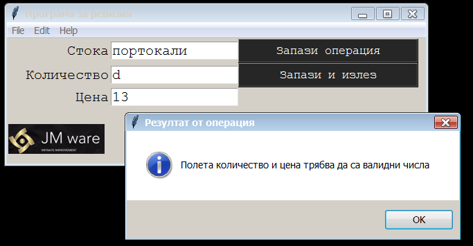

# Project Name
> Desktop application for making regular revision 
>of small shop. 
> 

## Table of contents
* [General info](#general-info)
* [Screenshots](#screenshots)
* [Technologies](#technologies)
<!--- 
* [Setup](#setup)
* [Features](#features)
* [Status](#status)
* [Manual with screenshots](#https://github.com/jmishev/python_inventory/blob/master/Manual%20.docx)
* [Contact](#contact)
-->
## General info

Project is started on request of a friend of mine that a bakery shop. He was annoyed by the complexity 
and inefficiency of the existing tools/applications in Bulgarian
This is the simplest version of revision using built in collections and 
extracting the results in excel. 

## Screenshots

## Technologies
* python 3.7.4
* tkinter 8.6
* mysqlclient 1.4.6
* onepyxl 3.0.2

<!--- 

## Code Examples
Show examples of usage:
`put-your-code-here`

## Features
List of features ready and TODOs for future development
* Awesome feature 1
* Awesome feature 2
* Awesome feature 3

To-do list:
* Wow improvement to be done 1
* Wow improvement to be done 2

## Status
Project is: _in progress_, _finished_, _no longer continue_ and why?

## Inspiration
Add here credits. Project inspired by..., based on...

## Contact
Created by [@flynerdpl](https://www.flynerd.pl/) - feel free to contact me!

-->